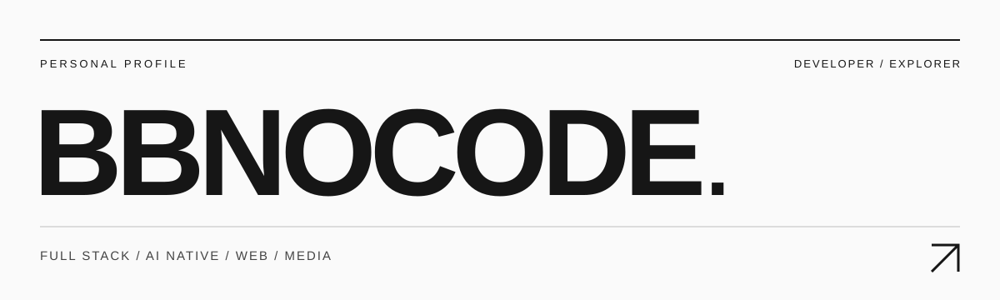
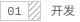
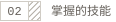
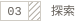
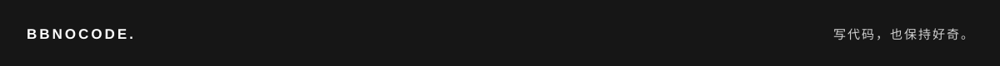

  

### 大家好，我是阿逼👋

全栈工程狮 / AI Native 开发者 / 前端工程师
爬虫爱好者 / 音视频解密专家

写代码，做产品，也喜欢研究技术背后的原理。

 

  
   
  
   
  

 

---

<h4>
  <picture>
    <source media="(prefers-color-scheme: dark)" srcset="./assets/section-01-dark.svg" />
    
  </picture>
</h4>

从前端界面到后端服务，关注体验，也关注实现。探索 AI 在产品和开发流程里的实际用法。

<h4>
  <picture>
    <source media="(prefers-color-scheme: dark)" srcset="./assets/section-02-dark.svg" />
    
  </picture>
</h4>

  
   
  
   
  
   
  

  
   
  
   
  
   
  

<h4>
  <picture>
    <source media="(prefers-color-scheme: dark)" srcset="./assets/section-03-dark.svg" />
    
  </picture>
</h4>

网页、接口、数据采集，以及音视频协议与加密机制。喜欢顺着问题往下挖，弄清楚它是怎么工作的。

<h4>
  <picture>
    <source media="(prefers-color-scheme: dark)" srcset="./assets/section-04-dark.svg" />
    
  </picture>
</h4>

在 [X / @bbnocode](https://x.com/bbnocode) 找我，在 [B站](https://space.bilibili.com/122650660) 看我的分享。
项目交流或技术讨论，也可以直接写信：**[bbnocode@outlook.com](mailto:bbnocode@outlook.com)**。

 

  

